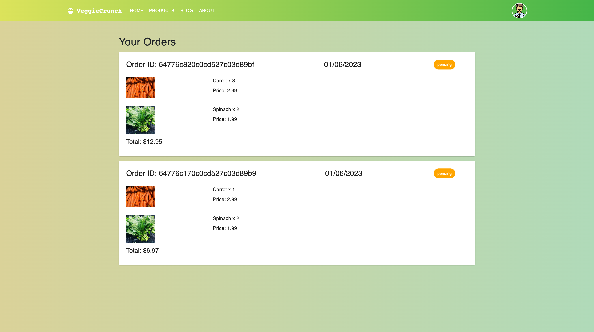
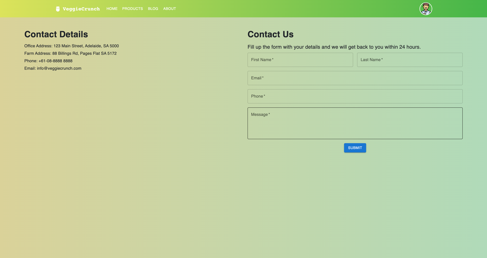

# VeggieCrunch


## Description

VeggieCrunch is an e-commerce platform designed to provide a seamless online shopping experience for consumers seeking fresh, organic produce. It offers a wide variety of vegetables and fruits, giving users a comprehensive selection of healthy options.

The project is built using a full-stack JavaScript architecture, commonly known as the MERN stack, which includes MongoDB, Express.js, React.js, and Node.js. This stack enables the development of scalable and performant applications using JavaScript on both the client and server sides. GraphQL and Apollo Client are used for efficient data fetching and state management in the React-based frontend. Furthermore, the Material-UI library is utilized for crafting intuitive and aesthetically pleasing user interfaces that follow Google's Material Design guidelines.

One of the main challenges faced during the development of VeggieCrunch was designing and implementing the User Dashboard. This feature involved fetching and displaying complex user data, including the detailed order history and corresponding product information. Specifically, issues arose around formatting and displaying dates correctly, displaying elements responsively on the dashboard, and calculating and rendering the total order price accurately.

These problems were addressed by leveraging JavaScript's native functionalities, employing the flexible grid system of Material-UI, and performing client-side calculations for order totals. JavaScript's Date object was used to format the timestamp string into a human-readable date. For the responsive design, Material-UI's Grid system was used extensively to ensure optimal layout on different screen sizes.

Through the process of developing VeggieCrunch, a greater understanding was gained in working with the MERN stack, GraphQL queries, and using hooks in React. Additionally, experience was gained in debugging, problem-solving, and overcoming challenges associated with displaying complex data in a user-friendly manner. VeggieCrunch stands as a testament to the effective use of the MERN stack and GraphQL in building efficient, user-focused e-commerce platforms.

## Table of Content

* [Installation](#installation)
* [Usage](#usage)
* [Contribution](#contribution)
* [License](#license)
  
## Made With


  
## Installation  

```
npm install
```

## Usage

To view this application,the following image shows the landing page of the application, or click on the page link that demonstrates the functionality of this project:\
<https://salty-oasis-93295.herokuapp.com>







## License


Link to license: <https://opensource.org/licenses/MIT>

```
Copyright (C) 2023 Gary GAO

Permission is hereby granted, free of charge, to any person obtaining a copy of this software and associated documentation files (the "Software"), to deal in the Software without restriction, including without limitation the rights to use, copy, modify, merge, publish, distribute, sublicense, and/or sell copies of the Software, and to permit persons to whom the Software is furnished to do so, subject to the following conditions:

The above copyright notice and this permission notice shall be included in all copies or substantial portions of the Software.

THE SOFTWARE IS PROVIDED "AS IS", WITHOUT WARRANTY OF ANY KIND, EXPRESS OR IMPLIED, INCLUDING BUT NOT LIMITED TO THE WARRANTIES OF MERCHANTABILITY, FITNESS FOR A PARTICULAR PURPOSE AND NONINFRINGEMENT. IN NO EVENT SHALL THE AUTHORS OR COPYRIGHT HOLDERS BE LIABLE FOR ANY CLAIM, DAMAGES OR OTHER LIABILITY, WHETHER IN AN ACTION OF CONTRACT, TORT OR OTHERWISE, ARISING FROM, OUT OF OR IN CONNECTION WITH THE SOFTWARE OR THE USE OR OTHER DEALINGS IN THE SOFTWARE.
  
```
  
## Contribution

Thanks for the start code provided by the web bootcamp.

## Tests

```
N/A
```

## Questions

N/A

## Contact

* For any question about this project, please email me at: gary.yanggao@gmail.com
* To see more of my projects, follow me on Github at: <http://github.com/Mid30s>
  
[](mailto:gary.yanggao@gmail.com)
[](https://github.com/Mid30s)
